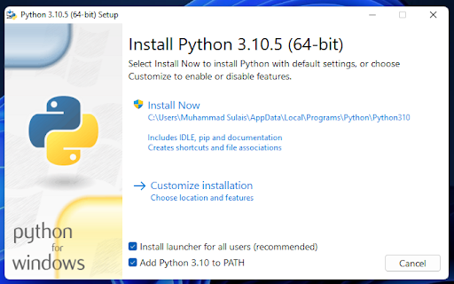

## Instalasi

OS pada zaman sekarang biasanya sudah memiliki bahasa pemrograman Python secara default. Untuk mengecek apakah OS yang Anda pakai sudah memiliki bahasa pemrograman Python, buka terminal, lalu ketik "*python --version*".

Jika hasil muncul dan tidak ada error, maka OS anda sudah terpasang bahasa pemrograman python dan tidak perlu lagi menginstall. Jika belum terinstall, maka anda dapat menginstalnya secara manual melalui https://www.python.org/downloads/. Jika sudah terdownload, buka file.

[Penting] Pastikan **Add Python 3.10 to PATH** tercentang sehingga anda tidak perlu menambah PATH secara manual.

Setelah itu click **Install Now**. Jika instalasi selesai, buka ulang Command Line Anda. Lalu ketik "*python --version*" seperti di atas. Jika Python sudah terinstall, anda dapat menggunakan IDE (Integrated Development Environments) untuk membuat program python. Salah satu contoh IDE adalah Visual Studio Code. Tapi anda dapat juga membuat program python melalui notepad, asalkan nama file tersimpan dengan berakhiran `.py`.

Python juga dapat dijalankan melalui terminal secara langsung tanpa harus membuat file. Caranya dengan mengetik "*python*" pada terminal.